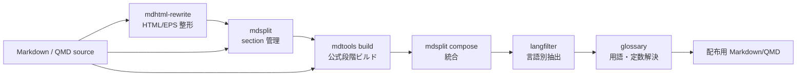
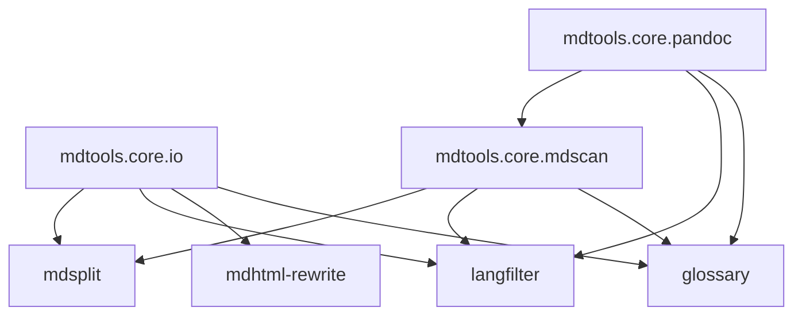

# mdtools

Markdown 文書の編集を補助するコマンドラインツール集。

| ツール | 概要 |
|--------|------|
| **build** | section 原稿から compose / langfilter / glossary を必要分だけ実行して配布用 Markdown/QMD を生成する |
| **mdsplit** | Markdown/QMD 文書を見出し単位のセクションファイルに分解・再構成する |
| **langfilter** | 日英併記 Markdown から指定言語のブロックだけを抽出する |
| **mdhtml-rewrite** | pandoc 変換後の HTML 断片を Quarto (.qmd) 互換の記法へ変換する |
| **glossary** | 用語・定数マーカーを定義ファイルから解決し、一覧表も出力する |



## 必要環境

- Python 3.13+
- 外部ライブラリ不要（標準ライブラリのみ）
- `mdhtml-rewrite convert` には Ghostscript (`gs`) と dvisvgm が別途必要

## インストール

### グローバルインストール（推奨）

```bash
uv tool install .
```

`mdtools` / `mdsplit` / `langfilter` / `mdhtml-rewrite` / `glossary` の 5 コマンドがシェルから直接使えるようになります。
コードを変更した場合は `uv tool install . --reinstall` で再インストールしてください。

### 開発用（エディタブルインストール）

```bash
uv pip install -e .
# インストール後は uv run <command> で呼び出す
uv run mdtools mdsplit --help
```

## 使い方

推奨入口は `mdtools <tool>` の統合コマンドです。個別コマンドの `mdsplit` / `langfilter` / `mdhtml-rewrite` / `glossary` も互換用ショートカットとして同じ機能を呼び出せます。
まずは `mdtools <tool> --help` でオプション定義と最小実行例を確認し、詳細は各 README の該当節を参照してください。

```bash
mdtools build document_sections/hierarchy.json --lang ja -f defs.yaml -o document.ja.qmd

mdtools mdsplit decompose document.md -o work/
# 上と同じ互換入口
mdsplit decompose document.md -o work/
```

### build

section 管理された原稿や単一 Markdown/QMD から、配布用の統合ファイルを作る公式ビルド入口。
入力が `hierarchy.json` の場合だけ `mdsplit compose` を先に実行し、`--lang en/ja` が指定された場合だけ `langfilter`、`-f/--defs` が指定された場合だけ `glossary resolve` を実行する。
各ステージ後の結果は中間ファイルに保存し、次ステージはそのファイルを入力として読む。

```bash
# section 原稿から英語版を生成
mdtools build manuscript_sections/hierarchy.json --lang en -f defs.yaml -o manuscript.en.qmd

# 日本語版。中間ファイルも確認したい場合
mdtools build manuscript_sections/hierarchy.json --lang ja -f defs.yaml -o manuscript.ja.qmd \
  --work-dir .build/manuscript-ja

# すでに単一ファイルへ統合済みなら compose は省略される
mdtools build manuscript.qmd --lang en -o manuscript.en.qmd
```

実行順は `compose → langfilter → glossary` が基本です。
`mdsplit compose` は小さな原稿ファイル群を単一の文書構造へ戻す段階なので先頭に置く。
`glossary` は `lang=...` fenced div を解釈しないため、言語別出力では `langfilter` を先に通してから用語を解決する。
`langfilter` は選択言語の wrapper 行を既定で除去するため、配布物に `::: {lang=...}` は残らない。

### mdsplit

大きな Markdown/QMD 文書をセクション単位のファイルに分解し、`hierarchy.json` で階層を管理する。
JSON を編集してセクションの順序や見出しレベルを変更してから再構成できる。

```bash
# 分解: document.md → work/ 以下のセクションファイル群
mdtools mdsplit decompose document.md -o work/

# 再構成: セクションファイル群 → 単一ファイル
mdtools mdsplit compose work/hierarchy.json -o reconstructed.md

# 参照ファイルの存在チェック
mdtools mdsplit verify work/hierarchy.json

# フラット構造で分解（ネスト無し）
mdtools mdsplit decompose document.md -o work/ --flat
```

詳細は [mdsplit/README.md](mdsplit/README.md) を参照。

### langfilter

`::: {lang=en}` / `::: {lang=ja}` の fenced div ブロックを認識し、指定言語以外を除去する。
対象言語の wrapper 行も既定で除去し、言語タグを持たないテーブル・コードブロック・図版はすべて保持される。

```bash
# 英語版を生成（ja ブロックを除去）
mdtools langfilter filter --lang en input.md -o output-en.md

# 日本語版を生成（en ブロックを除去）
mdtools langfilter filter --lang ja input.md -o output-ja.md

# stdin/stdout パイプライン
mdtools mdsplit compose work/hierarchy.json | mdtools langfilter filter --lang en > core-en.md

# 検査用に lang fenced div を残す
mdtools langfilter filter --lang en --keep-lang-fences input.md -o output-en-debug.md
```

詳細は [langfilter/README.md](langfilter/README.md) を参照。

### mdhtml-rewrite

pandoc が出力した HTML ベースの Markdown（`<figure>`, `<div>`, 参照リンクなど）を
Quarto の記法へ段階的に変換する。`mdtools` からは `rewrite` として呼び出す。3 つのサブコマンドを順に使うのが基本ワークフロー。

```bash
# 1. EPS ファイルを SVG/PNG へ一括変換
mdtools rewrite convert doc/ --dry-run          # 対象確認
mdtools rewrite convert doc/ --report report.json

# 2. 文書内の HTML 要素を調査
mdtools rewrite inventory document.md -o inv.json

# 3. HTML 断片を Quarto 記法へ変換
mdtools rewrite rewrite document.md -o document.qmd \
  --inventory inv.json --report rewrite-report.json
```

EPS 変換の詳細（`dvisvgm` の注意点など）は [mdhtml_rewrite/README.md](mdhtml_rewrite/README.md) を参照。

### glossary

用語・定数・記号を 1 本の定義ファイル (JSON / YAML) に登録し、本文中の
Pandoc bracketed span マーカー (`[]{.term id=unit}` 等) を言語別に解決する。
`langfilter` の後段で走らせる運用が基本。

```bash
# 英語版: 言語抽出 → 用語解決
mdtools langfilter filter --lang en manuscript.qmd | \
  mdtools glossary resolve --lang en -f defs.json > manuscript.en.md

# 日本語版
mdtools langfilter filter --lang ja manuscript.qmd | \
  mdtools glossary resolve --lang ja -f defs.json > manuscript.ja.md

# 登録済みエントリの一覧 (デフォルト: テキスト表)
mdtools glossary list -f defs.json --kind term
mdtools glossary list -f defs.json --format json

# 本文マーカーの定義漏れを検出 (CI 用, exit code で通知)
mdtools glossary verify manuscript.qmd -f defs.json
```

詳細とスキーマ定義は [glossary/README.md](glossary/README.md) を参照。

## 典型的なワークフロー

```bash
# EPS 画像を Web 向け形式へ変換
mdtools rewrite convert doc/

# HTML 断片を Quarto 記法へ変換
mdtools rewrite inventory doc/combined.md -o inv.json
mdtools rewrite rewrite doc/combined.md -o doc/combined.qmd --inventory inv.json

# 必要に応じてセクション分割して編集
mdtools mdsplit decompose doc/combined.qmd -o work/
# ... セクションファイルを編集 ...

# 配布用の言語別バージョンを公式ビルド手順で出力
mdtools build work/hierarchy.json --lang en -f doc/defs.json -o doc/en.qmd
mdtools build work/hierarchy.json --lang ja -f doc/defs.json -o doc/ja.qmd --work-dir .build/ja
```

## mdtools.core

`mdtools.core` は、各ツールに重複していた I/O、Markdown スキャン、Pandoc/Quarto 属性処理を集約した内部共通パッケージです。公開 CLI は維持し、内部実装だけを共有しています。



実施記録は [docs/plans/core-refactor.md](docs/plans/core-refactor.md) にあります。用語としての []{.term id=mdtools-core} は `docs/glossary/defs.yaml` でも管理します。

## 文書管理

主要 Markdown 文書は `mdsplit` で section 管理します。canonical `.md` と対応する `*_sections/` は同じ変更として扱い、最後に round-trip を確認します。

```bash
mdtools mdsplit decompose README.md -o README_sections
mdtools mdsplit verify README_sections/hierarchy.json
mdtools mdsplit compose README_sections/hierarchy.json | diff - README.md
```

用語定義は `docs/glossary/defs.yaml` に置き、マーカーを含む文書は `mdtools glossary verify` で検証します。

## テスト

```bash
uv run pytest -q
```

core リファクタ後の現在の基準は `190 passed, 1 skipped` です。

## ライセンス

MIT

## ドキュメント運用ルール（README / --help 同期）

### 基本方針

- README は「背景、設計意図、詳細ユースケース、主要コマンド例」の原典とする。
- `--help` は「実行時に必要な操作情報（オプション定義・短い例）」と README の参照先を示す。
- 主導線は `mdtools <tool>` とし、個別コマンドは互換用ショートカットとして扱う。

### 変更時チェックリスト（簡易運用）

1. README 側の「使い方」または「主要コマンド例」を変更し、CLI の `epilog` が同じ意図を短く参照しているか。
2. CLI の `epilog` を変更した場合、対応する README 節が原典として読める状態になっているか。
3. `--help` は短い実行例と README 参照先に留め、背景説明や長文の運用ノウハウは README に寄せたか。
4. 仕上げに次を実行し、差分が意図通りか確認したか。

```bash
mdtools --help
mdtools build --help
mdtools mdsplit --help
mdtools langfilter --help
mdtools rewrite --help
mdtools glossary --help
git diff -- README.md mdsplit/README.md mdhtml_rewrite/README.md langfilter/README.md glossary/README.md \
  mdtools/main.py mdtools/build_cli.py mdsplit/cli.py mdhtml_rewrite/cli.py langfilter/cli.py glossary/cli.py
```
