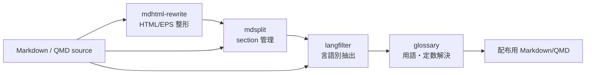

Markdown 文書の編集を補助するコマンドラインツール集。

| ツール | 概要 |
|--------|------|
| **mdsplit** | Markdown/QMD 文書を見出し単位のセクションファイルに分解・再構成する |
| **langfilter** | 日英併記 Markdown から指定言語のブロックだけを抽出する |
| **mdhtml-rewrite** | pandoc 変換後の HTML 断片を Quarto (.qmd) 互換の記法へ変換する |
| **glossary** | 用語・定数マーカーを定義ファイルから解決し、一覧表も出力する |

