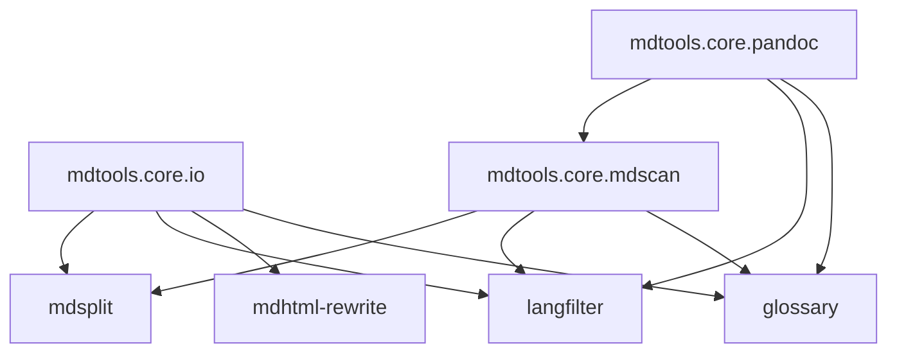

`mdtools.core` は、各ツールに重複していた I/O、Markdown スキャン、Pandoc/Quarto 属性処理を集約した内部共通パッケージです。公開 CLI は維持し、内部実装だけを共有しています。

実施記録は [docs/plans/core-refactor.md](docs/plans/core-refactor.md) にあります。用語としての []{.term id=mdtools-core} は `docs/glossary/defs.yaml` でも管理します。
