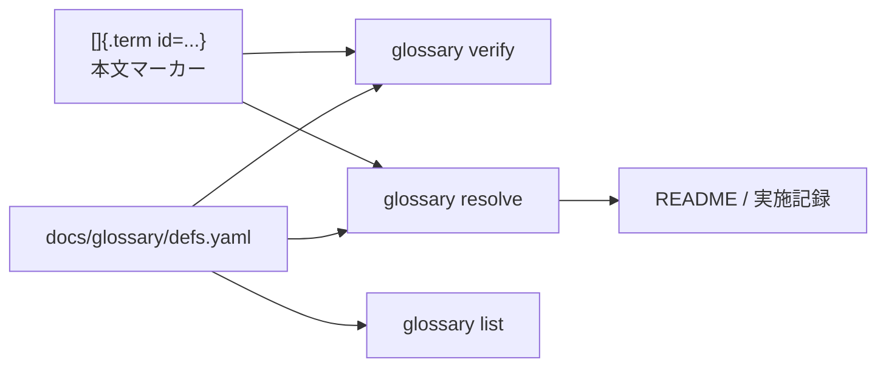

# mdtools 用語集

この文書は `docs/glossary/defs.yaml` の運用例です。本文中のマーカーを `glossary verify` で検証し、`glossary resolve` で言語別に展開できます。

## 用語管理の目的

[]{.term id=mdtools} の文書では、ツール名、内部モジュール名、Markdown/Pandoc 構文名が頻出します。これらを定義ファイルに集めることで、説明文と一覧表を同じ情報源から生成できます。



## 主要用語

`mdtools.core` のリファクタでは、[]{.term id=mdtools-core}、[]{.term id=code-fence-tracker}、[]{.term id=pandoc-attrs} が中心になりました。文書分割の運用では、[]{.term id=mdsplit} が生成する []{.term id=hierarchy-json} と []{.term id=section-file} を一緒に管理します。

## コマンド例

```bash
glossary verify docs/glossary/README.md -f docs/glossary/defs.yaml
glossary resolve docs/glossary/README.md --lang ja -f docs/glossary/defs.yaml
glossary list -f docs/glossary/defs.yaml --kind term
```

## 自動生成される一覧

以下の fenced div は `glossary resolve` で Markdown 表へ展開されます。

::: {.glossary format=table}
:::
