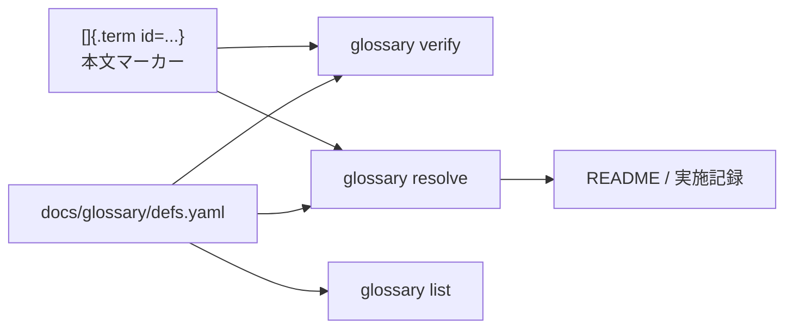

[]{.term id=mdtools} の文書では、ツール名、内部モジュール名、Markdown/Pandoc 構文名が頻出します。これらを定義ファイルに集めることで、説明文と一覧表を同じ情報源から生成できます。

```mermaid
flowchart LR
    defs["docs/glossary/defs.yaml"]
    marker["[]{.term id=...}<br/>本文マーカー"]
    verify["glossary verify"]
    resolve["glossary resolve"]
    list["glossary list"]
    docs["README / 実施記録"]

    defs --> verify
    marker --> verify
    defs --> resolve
    marker --> resolve
    defs --> list
    resolve --> docs
```
