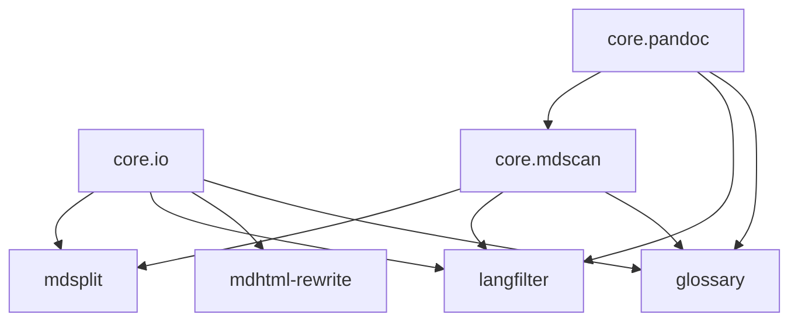
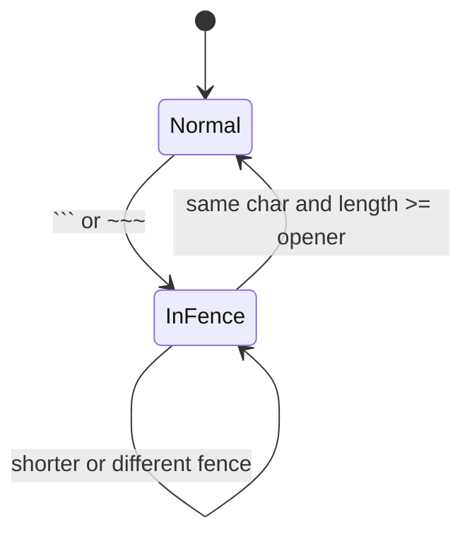

# mdtools.core リファクタ実施記録

`mdtools.core` は、mdtools の各ツールに重複していた I/O、Markdown スキャン、Pandoc/Quarto 属性処理を共通化するために追加した内部パッケージです。この文書は初期計画ではなく、現在の実装結果と設計判断を記録します。

## 背景

`mdsplit`、`langfilter`、`mdhtml-rewrite`、`glossary` はそれぞれ独立した CLI として始まりました。glossary 追加後、以下の重複が目立つようになりました。

- stdin/stdout と UTF-8 ファイル I/O
- JSON/YAML 読み書きと `ensure_ascii=False, indent=2` の JSON 出力
- Markdown code fence の状態追跡
- Pandoc/Quarto 属性の正規表現とパース処理

これらを []{.term id=mdtools-core} に集約し、公開 CLI は維持したまま内部実装だけを整理しました。

## 最終構成



### core.io

`mdtools.core.io` は text/JSON/YAML の共通 I/O を提供します。CLI の stdin/stdout 処理、JSON report の読み書き、glossary 定義ファイルの読み込みに使います。

主な API:

- `read_text_or_stdin(path)`
- `write_text_or_stdout(text, path)`
- `read_json(path)` / `write_json(path, obj)`
- `dumps_json(obj)`
- `read_structured_file(path)`
- `StructuredFileError`

### core.mdscan

`mdtools.core.mdscan` は Markdown 行を code fence 内外で分類します。`scan_md_lines()` / `scan_md_lines_from_list()` は多くの caller が使う高レベル API です。`mdsplit` のように `<pre>` など caller 固有の除外領域を先に扱いたい場合は、`CodeFenceTracker` を直接使います。



### core.pandoc

`mdtools.core.pandoc` は Pandoc/Quarto 由来の構文を共有します。

- `CODE_FENCE_RE`
- `FENCE_CLOSE_RE`
- `DIV_OPEN_RE`
- `BRACKETED_SPAN_RE`
- `parse_attrs()`
- `PandocAttrs`

`parse_attrs()` は class と key-value を順序に依存せず抽出します。そのため `::: {.note lang=en}` や `::: {.note .glossary filter=term}` のような属性順序でも、`langfilter` と `glossary` は意図した属性を扱えます。

## 採用した仕様改善

リファクタ中に master 実装との差分がいくつか見つかりました。最終的には、Markdown/Pandoc 的に自然な挙動は新仕様として採用し、共通化で caller 固有の優先順位を壊した箇所だけ修正しました。

| 領域 | 現在の仕様 |
|------|------------|
| langfilter | `lang` 属性は属性順序に依存しない |
| langfilter | `::: {lang=en} trailing` は Pandoc fenced div として扱わない |
| langfilter | code fence 内の `:::` では lang block を閉じない |
| glossary | `.glossary` class は属性順序に依存しない |
| glossary | glossary block 内 code fence の `:::` では block を閉じない |
| mdsplit | `<pre>` 内では Markdown code fence marker を追跡しない |
| mdscan | opener より短い closing fence では code fence を閉じない |

## 実装の流れ


1. `core.io` を追加し、CLI と JSON/YAML I/O を移行しました。
2. `core.mdscan` を追加し、code fence 追跡を共有しました。
3. `core.pandoc` を追加し、Pandoc/Quarto 属性処理を共有しました。
4. `CodeFenceTracker` を追加し、`mdsplit` が `<pre>` 優先順位を維持できるようにしました。
5. 仕様改善として採用する差分をテスト名と README で明示しました。

## テスト結果

現在の基準は次の通りです。

```bash
uv run pytest -q
```

結果:

```text
190 passed, 1 skipped
```

追加された core テストは以下を守ります。

- `core.io`: stdin/stdout、UTF-8、JSON/YAML、エラー処理
- `core.mdscan`: code fence の開閉、短い closing fence、trailing newline 保持
- `core.pandoc`: 属性順序、class/key-value、fenced div と bracketed span

## 今後の候補

- `mdtools.core.cli`: help epilog や argparse 設定の共通化
- `mdtools.core.tree`: `mdsplit` の tree traversal helper の切り出し
- `mdtools.core.html`: `mdhtml-rewrite` の HTML 正規表現と model helper の整理

これらは今回の core refactor の範囲外です。公開 CLI と既存ファイル形式の互換性を優先して、必要になった段階で小さく切り出します。
