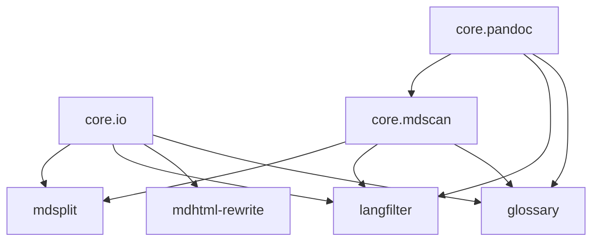

```mermaid
flowchart TB
    io["core.io"]
    mdscan["core.mdscan"]
    pandoc["core.pandoc"]
    mdsplit["mdsplit"]
    langfilter["langfilter"]
    rewrite["mdhtml-rewrite"]
    glossary["glossary"]

    io --> mdsplit
    io --> langfilter
    io --> rewrite
    io --> glossary
    pandoc --> mdscan
    mdscan --> mdsplit
    mdscan --> langfilter
    mdscan --> glossary
    pandoc --> langfilter
    pandoc --> glossary
```
