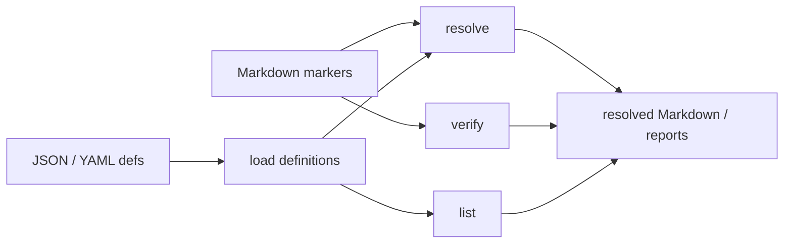

```mermaid
flowchart LR
    defs["JSON / YAML defs"]
    input["Markdown markers"]
    load["load definitions"]
    resolve["resolve"]
    verify["verify"]
    list["list"]
    output["resolved Markdown / reports"]

    defs --> load
    input --> resolve
    load --> resolve --> output
    input --> verify --> output
    load --> list --> output
```
