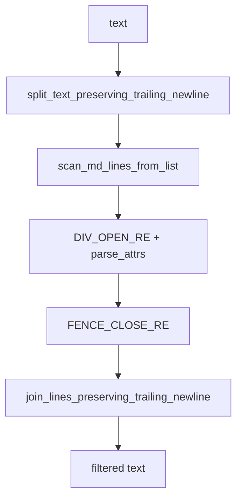

# langfilter 実装記録

## 背景

IMAX2 コアアーキテクチャ文書化（Phase 0）の基盤ツールとして、日英併記 Markdown から単一言語版を生成する `langfilter` を作成した。その後の `mdtools.core` リファクタで、Markdown スキャンと Pandoc/Quarto 属性処理は共通モジュールへ移した。

要件定義: `docs/IMAX2/core/PHASE0-INFRASTRUCTURE.md` Section 1
受け入れ条件: 同ファイル末尾「Phase 0 の受け入れ条件」langfilter 項

## 設計判断

| 判断 | 決定 | 理由 |
|------|------|------|
| keep 時のマーカー | 保持 | Quarto で lang 属性によるスタイリングが将来可能 |
| 除去後の空行 | そのまま保持 | シンプルで予測可能。連続空行は Markdown として無害 |
| `both` モード | 入力をそのまま返す | 非破壊的なデフォルト |
| `:::` の閉じ判定 | `mdtools.core.mdscan` と `FENCE_CLOSE_RE` で追跡 | コードフェンス内の `:::` では lang ブロックを閉じない |
| 非 lang fenced div | パススルー | `lang` 属性がない `::: {.note}` 等は触らない |
| 属性順序 | 順序に依存しない | `::: {.note lang=en}` も lang ブロックとして扱う |
| Phase 0 非目標 | テーブル列単位の言語分離、図中ラベル翻訳 | PHASE0 文書で明記 |

## アーキテクチャ

```
langfilter/
├── __init__.py        # モジュール docstring
├── __main__.py        # エントリポイント → cli.main()
├── cli.py             # argparse: filter サブコマンド、core.io 経由の I/O
├── filter.py          # filter_lang() 純粋関数
└── tests/
    ├── __init__.py
    ├── README.md      # テストプラン
    └── test_filter.py # 挙動仕様テスト

mdtools/core/
├── io.py              # stdin/stdout と UTF-8 text I/O
├── mdscan.py          # code fence 状態追跡
└── pandoc.py          # DIV_OPEN_RE / FENCE_CLOSE_RE / parse_attrs
```

### モジュール責務

| モジュール | 責務 |
|-----------|------|
| `filter.py` | 純粋関数 `filter_lang(text, lang) -> str`。I/O なし。core.mdscan と core.pandoc を使う |
| `cli.py` | 引数解析、core.io 経由の入力/出力、filter_lang() 呼び出し |

## アルゴリズム: core 連携の行単位処理



### 状態

- `current_lang is None` — lang ブロック外
- `current_lang is not None` — lang ブロック内
- `MdLine.in_code_fence` — `mdtools.core.mdscan` が付与する code fence 分類

### 正規表現

`langfilter` 自身は lang 専用の正規表現を持たない。`mdtools.core.pandoc.DIV_OPEN_RE` で fenced div の属性を取り出し、`parse_attrs()` の `kv["lang"]` を見る。

### 遷移ロジック

```
for each line:
  NORMAL:
    code fence? → IN_CODE_FENCE, emit
    lang open?  → IN_LANG_BLOCK
      match lang? → emit (keep with markers)
      else        → skip (remove)
    otherwise   → emit

  IN_CODE_FENCE:
    always emit
    closing fence? → NORMAL

  IN_LANG_BLOCK:
    lang close? → NORMAL
      match lang? → emit closing :::
      else        → skip
    otherwise:
      match lang? → emit content
      else        → skip
```

### エッジケース

| ケース | 処理 |
|--------|------|
| EOF 前の未閉じ lang ブロック | ブロック内として扱い続ける（クラッシュしない） |
| lang ブロック内のコードフェンス | code fence 内の `:::` では閉じない |
| 非 lang fenced div | `lang` key がなければ素通り |
| 属性ブロック後の trailing text | Pandoc fenced div として扱わず通常行として保持 |
| NORMAL 状態の裸の `:::` | そのまま出力 |
| 末尾改行の有無 | 入力の末尾改行状態を保存・復元 |

## テスト戦略

t-wada 式 TDD の段階構成を維持しつつ、core リファクタ後の仕様改善を characterization として追加した。詳細は `tests/README.md` を参照。

### テストカテゴリ

| Phase | 件数 | 内容 |
|-------|------|------|
| 1. 退化ケース | 3 | 空入力、lang ブロックなし、both モード |
| 2. 単一ブロック | 4 | keep/remove の基本動作 |
| 3. 複数ブロック | 3 | en/ja ペアのフィルタリング |
| 4. 共有コンテンツ | 4 | テーブル、コード、画像、HTML コメントの保存 |
| 5. コードフェンス | 4 | コードフェンス内の `:::` 無視、lang ブロック内のコードフェンス |
| 6. 構文バリエーション | 4 | 空白、引用符、brace の位置 |
| 7. 非 lang div | 3 | `::: {.note}` 等のパススルー |
| 8. エッジケース | 9 | 空ブロック、未閉じ、連続、unknown lang、改行 |
| 9. CLI 統合 | 4 | ファイル I/O、stdin、デフォルト lang |
| 10. 全体統合 | 3 | 実文書相当の入力で en/ja/both |

## 検証

```bash
uv run pytest langfilter/tests/ -v
```
