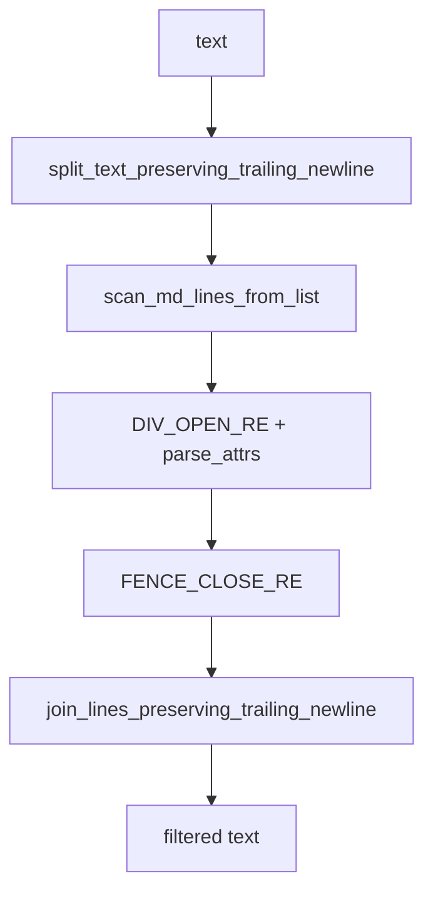

```mermaid
flowchart TD
    input["text"]
    split["split_text_preserving_trailing_newline"]
    scan["scan_md_lines_from_list"]
    attrs["DIV_OPEN_RE + parse_attrs"]
    close["FENCE_CLOSE_RE"]
    join["join_lines_preserving_trailing_newline"]
    output["filtered text"]

    input --> split --> scan --> attrs --> close --> join --> output
```
