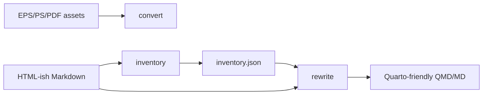

まず `--help` でサブコマンドと主要オプションを確認してください。

```bash
mdhtml-rewrite --help
```


```mermaid
flowchart LR
    eps["EPS/PS/PDF assets"]
    convert["convert"]
    htmlmd["HTML-ish Markdown"]
    inventory["inventory"]
    invjson["inventory.json"]
    rewrite["rewrite"]
    qmd["Quarto-friendly QMD/MD"]

    eps --> convert
    htmlmd --> inventory --> invjson --> rewrite
    htmlmd --> rewrite --> qmd
```
