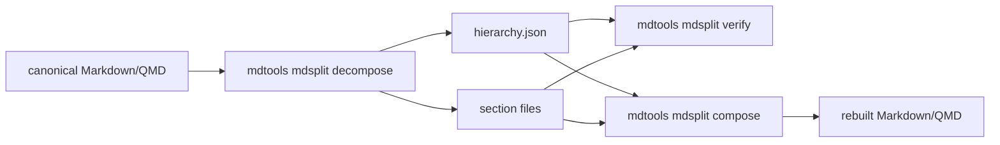

最初に `mdtools mdsplit --help` を確認し、利用可能なサブコマンドとオプションを把握してください。個別コマンド `mdsplit` も同じ機能を呼び出す互換入口です。

```bash
mdtools mdsplit --help
mdsplit --help
```

リポジトリルートから実行する場合:

```bash
# 分解: Markdown → セクションファイル + hierarchy.json
mdtools mdsplit decompose doc/emax6/combined.md -o output/

# 再構成: hierarchy.json + セクションファイル → Markdown
mdtools mdsplit compose output/hierarchy.json -o reconstructed.md

# 検証: 参照ファイルの存在チェック
mdtools mdsplit verify output/hierarchy.json
```


